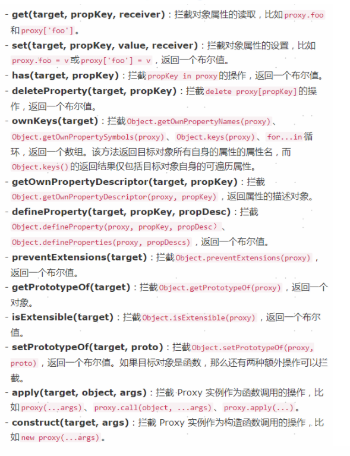

# ES6

标签（空格分隔）： 前端

---
### 1. 默认参数
定义参数时可以设定默认值，调用时若无传值，则使用默认值。
参数较多时，省略了对每个参数检查是否有值。
```javascript
//ES6
function f(x, y = 1, z = 2) {
    return x + y + z
}

//ES5
function f(x, y, z) {
    if (y === undefined) {
        y = 1
    }
    if (z === undefined) {
        z = 2
    }
    return x + y + z
}
```


### 2.可变参数
函数参数个数不固定时，用...可以直接获取所有入参
...为扩展运算符
a为可变参数的列表，类型为数组

```javascript
//ES6中使用...扩展运算符获取入参
function f(...a) {
    var sum = 0;
        a.forEach(item => {
            sum += item
        })
    return sum
}


//ES5中要用arguments获取入参的值
function f() {
    var a = Array.prototype.slice.call(arguments)
    var sum = 0;
    a.forEach(function (item) {
        sum += item
    })
    return sum
}
```

### 3.对象代理Proxy

    Proxy是外界访问对象的拦截器，可以对外界的访问进行过滤和改写，拦截操作有13种。
   
   **ps.有空要把剩下11种学习完啊**
   
   

- get()和set()
    get参数：目标对象、属性名
    set参数：目标对象、属性名、属性值

```javascript
let Person = {
    name: 'es6',
    sex: 'female',
    age: 15
}
let person = new Proxy(Person, {
    get(target, key) {
        return target[key]
    },
    set(target, key, value) {
        if (key != 'sex') {
        return target[key] = value
        }
    }
})
person.age = 99
console.table({
    name: Person.name, //es6
    sex: Person.sex, // female
    age: Person.age, //99
})
person.sex = 'male' //报错
```

### 4.let 和const
 - `let`声明的变量只在块级作用域有效

